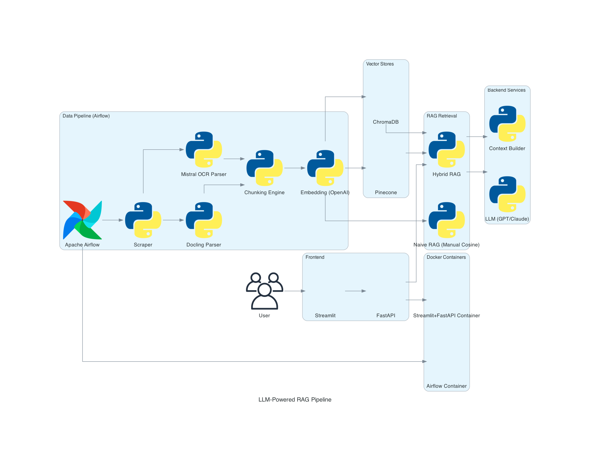

# 🧠 RAG Pipeline

An end-to-end **Retrieval-Augmented Generation (RAG)** system that automates the ingestion, processing, and retrieval of **NVIDIA quarterly reports** using **Apache Airflow**, multiple **PDF parsers**, vector databases (**Pinecone**, **ChromaDB**), and a user-friendly **Streamlit + FastAPI interface**.

---
## 🧠 LLM-Powered RAG Pipeline Architecture

---
## 🚀 Project Summary

We built an AI-powered pipeline that:
- Ingests and parses unstructured data (PDFs)
- Implements both naive and vector-based RAG retrieval
- Supports quarter-specific hybrid search
- Exposes a user-friendly frontend and robust backend
- Is containerized with Docker for seamless deployment

---

## ⚙️ Setup Overview

1. Clone the repository and install dependencies in a virtual environment.
2. Set up AWS credentials for S3 access.
3. Run Apache Airflow to scrape and parse quarterly PDF reports.
4. Use the backend service to compute embeddings and perform retrieval.
5. Launch the frontend to query documents using RAG.

---

## 🧬 Features & Components

### ✅ 1. Data Pipeline (Airflow)
- Automatically scrapes NVIDIA quarterly reports from the official website
- Stores raw PDFs in AWS S3
- Supports weekly or on-demand DAG runs
- Parses PDFs using:
  - Assignment 1 parser
  - Docling
  - Mistral OCR

### ✅ 2. RAG System (Core Implementation)

- **Naive RAG:** Uses manual cosine similarity with sentence-transformer embeddings.
- **Pinecone:** Cloud-based vector database for scalable retrieval.
- **ChromaDB:** Local vector DB for lightweight, open-source deployment.
- **Chunking Strategies:** Includes recursive, token-based, and semantic splitting.
- **Hybrid Search:** Supports filtering document chunks by quarter (e.g., "Q3 2023").

### ✅ 3. Streamlit + FastAPI

- Frontend built with Streamlit for selecting parsers, chunkers, and retrieval methods.
- Backend built with FastAPI to handle document processing and context generation.
- Query responses powered by your preferred LLM (e.g., OpenAI, Claude, Gemini).

### ✅ 4. Dockerized Deployment

- Airflow container for ingestion, scraping, and parsing
- App container for FastAPI backend and Streamlit frontend

---

## 🔧 Usage Instructions

- Upload PDFs manually or allow Airflow to fetch them.
- Choose your desired PDF parser, chunking method, and RAG strategy from the Streamlit UI.
- Filter queries by specific quarters for hybrid retrieval.
- Ask a natural language question and retrieve relevant context from quarterly reports.

---

## 📊 Chunking Strategies Implemented

- **Recursive Character Splitter** – Splits based on newlines, structure, and max length
- **Token-Based Splitter** – Splits text by token count using OpenAI tokenizer
- **Semantic Sentence Splitter** – Splits by sentence boundaries using NLTK

---

## 🔍 Hybrid Search

The system supports hybrid retrieval by allowing the user to query only specific quarters. This ensures the returned context is strictly limited to relevant timeframes.

---

## ✅ AI Tools Disclosure

| Tool               | Purpose                                  |
|--------------------|-------------------------------------------|
| SentenceTransformers | Generate text embeddings                |
| Pinecone             | Vector database for similarity search   |
| ChromaDB             | Local vector store for document chunks  |
| Mistral OCR          | Enhanced text extraction from PDFs      |

---

## 🎥 Submission Requirements

| Deliverable               | Status |
|---------------------------|--------|
| GitHub Repository         | ✅     |
| Project Summary & PoC     | ✅     |
| GitHub Issues Tracking    | ✅     |
| Diagrams & CodeLab        | ✅     |
| 5-minute Demo Video       | ✅     |
| Hosted Frontend/Backend   | ✅     |

---

## 🧑‍🤝‍🧑 Team Contribution

| Member        | Responsibility                                |
|---------------|------------------------------------------------|
| Member 1      | Data ingestion + Airflow pipeline              |
| Member 2      | PDF parsing (Assignment 1, OCR, Docling)       |
| Member 3      | RAG system, chunking, vector DBs, hybrid search|

---

## 📘 Resources

- Docling GitHub
- Mistral OCR
- Pinecone Docs
- ChromaDB Docs
- LangChain Text Splitters

---

## 💡 Notes

- Ensure AWS credentials are securely configured if using S3.
- Run Airflow before querying to keep reports up-to-date.
- Preload and index PDFs in Pinecone/ChromaDB for optimized performance.

---
